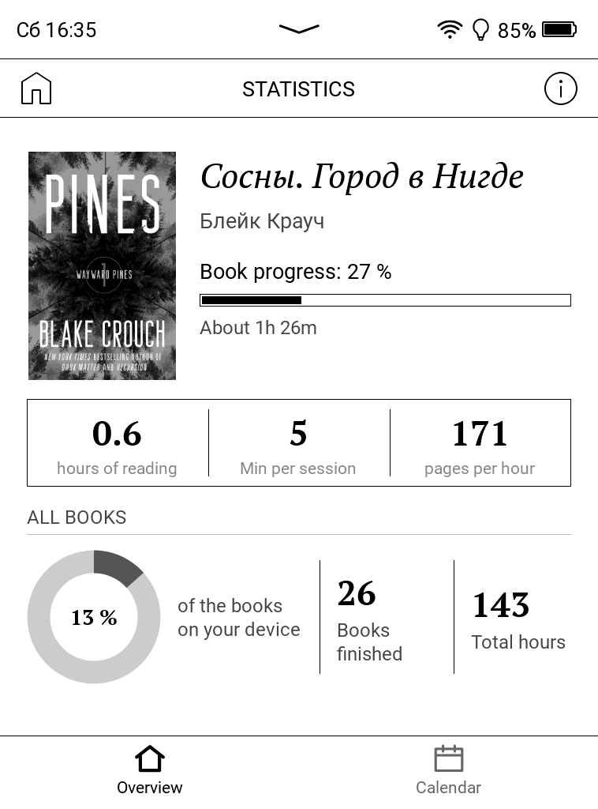

# PocketBook Statistics

Reading statistics for stock PocketBook e-readers. The firmware already records
what you read and when you last touched it; this app turns that into a stats
screen, built from the firmware's own UI components so it looks like it belongs
there.

| Overview | Calendar |
|---|---|
|  |  |

Shot on a PB629 with a filled-in history, so the calendar shows what a used
month looks like rather than a first day of tracking.

> Developed and tested on a **PocketBook Verse (PB629), firmware
> U629.6.10.1461**. Other Allwinner **B288/B300** readers on Qt 6.8 firmware
> should work the same way, but none has been tried — reports welcome.

## The two screens

**Overview** answers "what am I reading, and how is it going". The book in hand
with its cover, how far in you are and how long is left at your own pace — the
estimate above says 3 h 18 min because it is built from *your* pages per hour,
not a nominal reading speed. Under it, three figures for that book and your
sessions; below, the library as a whole: a ring of how much of what is on the
device you have read, the all-time count of finished books, total hours.

The ring counts part-read books, not just finished ones. Above it says 13 % on a
shelf where nothing is finished yet — a book open at page 48 of 100 counts as
half a book. Whole finished books are drawn as a solid arc on top, so finishing
one still shows as a step. The count beside it (26) is different on purpose: it
is every book ever finished, including the ones since deleted, while the ring is
only the library you have now.

**Calendar** shows the month with the cover of whatever you read most that day,
`+1` when there was more than one book. Tap a day for the breakdown, tap a book
for its detail. Days before tracking began are dimmed and the reason is printed
under the grid — an empty month reads as "not recorded yet", not as a bug.

The **ⓘ** in the header opens version and update; it sits opposite the reader's
home button because an update check is a detour, not a screen.

Covers come from your EPUBs when the firmware's cache is wrong for a sideloaded
book, and are kept in the app's own cache — that is why a finished book still
has a thumbnail in the calendar after you delete the file. The interface follows
the device language across 29 of them, and falls back to English.

## How the time is counted

The firmware keeps no session history. Per book it stores when it was opened,
when the position last moved, and which page you are on — one point per book,
never a history. A daemon in the same binary reads that database **read-only**
every 30 seconds and turns movements of the position into reading time. Gaps are
capped at ten minutes, so a book left open overnight does not become eight hours
of reading, and a session is split at local midnight so day figures stay honest.

The daemon starts with the app and keeps running after you close it, through
sleep. It does not survive a reboot — open the app once after switching the
reader on, and it is back. Time missed while it was not running is reconstructed
from the firmware's own timestamps, capped at 90 minutes per book, and marked as
an estimate: it counts toward total hours but never toward averages, pages per
hour or session counts.

Nothing before the install date is presented as history, because there is none
to present. Finished books are the exception — the firmware dates those itself,
so they show whenever they happened, and "finished" always means the firmware's
own *mark as read* flag, exactly as the Library app shows it.

## Privacy

Your reading data never leaves the device: no account, no telemetry, nothing
uploaded. The app only **reads** the firmware's library database and writes its
own files under `system/pocketbook-statistics/`.

One request goes out, to `api.github.com`, and only when you press *Check for
update*. There is no background check and no other host is ever contacted.

## Install

1. Download the `.zip` from the [latest release](../../releases/latest) and
   unpack it.
2. Copy `PocketBookStatistics.app` to `applications/` on the reader over USB.
3. Eject, open the app once, then reboot so the custom launcher icon appears.

The tile is labelled in the reader's language ("Statistics", "Статистика",
"Statistik", …) — it says what it does, like the firmware's own tiles. First
launch registers it by adding one entry to
`system/config/desktop/view.json`, backed up beside it as
`view.json.pbstatistics-backup`. If that file cannot be written, the app still
runs with the default icon.

**Updating:** ⓘ → *Check for update* does it on the device — fetches the
release, swaps the binary, restarts. Copying a newer `PocketBookStatistics.app`
over the old one via USB works too. Your statistics are left alone either way.

**Uninstall:** delete `applications/PocketBookStatistics.app`; restore
`view.json` from the backup to remove the launcher tile, and delete
`system/pocketbook-statistics/` to remove the statistics with it.

## Under the hood

One ARM binary that is both the app and its daemon, linking the Qt 6.8.2 that is
already on the reader — nothing Qt is bundled. See [BUILDING.md](BUILDING.md):
`make sdk` once, then `make qt` produces `build-qt/PocketBookStatistics.app`;
`make test` runs the host-side tests.

[docs/DEVICE-DATA.md](docs/DEVICE-DATA.md) is the survey of what the firmware
actually stores — both databases, the cover cache, the hash that joins them, and
what is missing, which is why the app derives sessions itself.
[docs/STATS-PLAN.md](docs/STATS-PLAN.md) is what the screens show and why,
measured against Kobo, KOReader and Goodreads.

## License and credits

MIT — see [LICENSE](LICENSE). Bundles [SQLite](https://www.sqlite.org/) (public
domain) and [miniz](https://github.com/richgel999/miniz) (MIT);
cross-compilation builds on
[fstanis/pocketbook-sdk-qt6](https://github.com/fstanis/pocketbook-sdk-qt6).

Not affiliated with PocketBook. It only reads the firmware's database and makes
a single backed-up edit to the launcher config, but you are installing
third-party software on your reader — use at your own risk.
