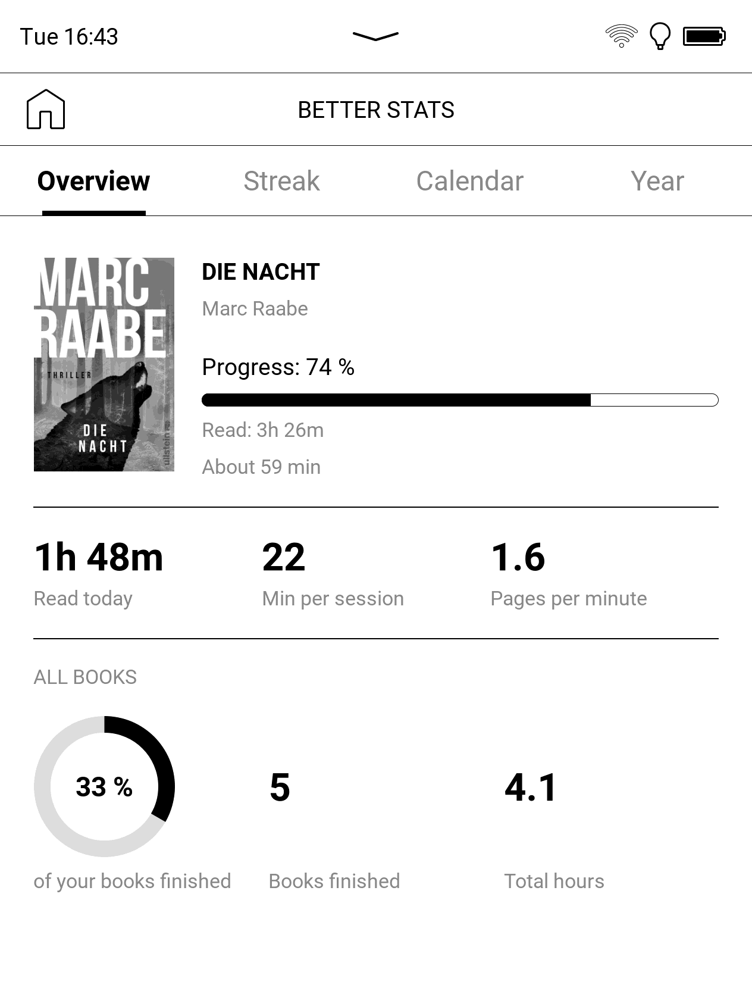
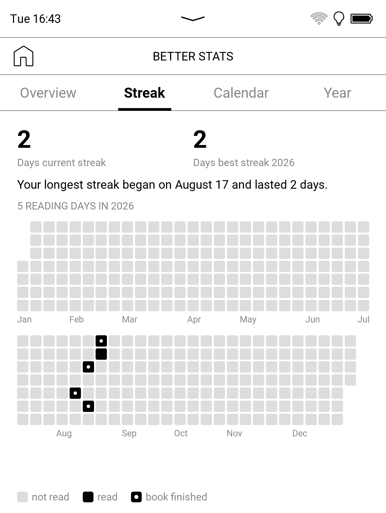
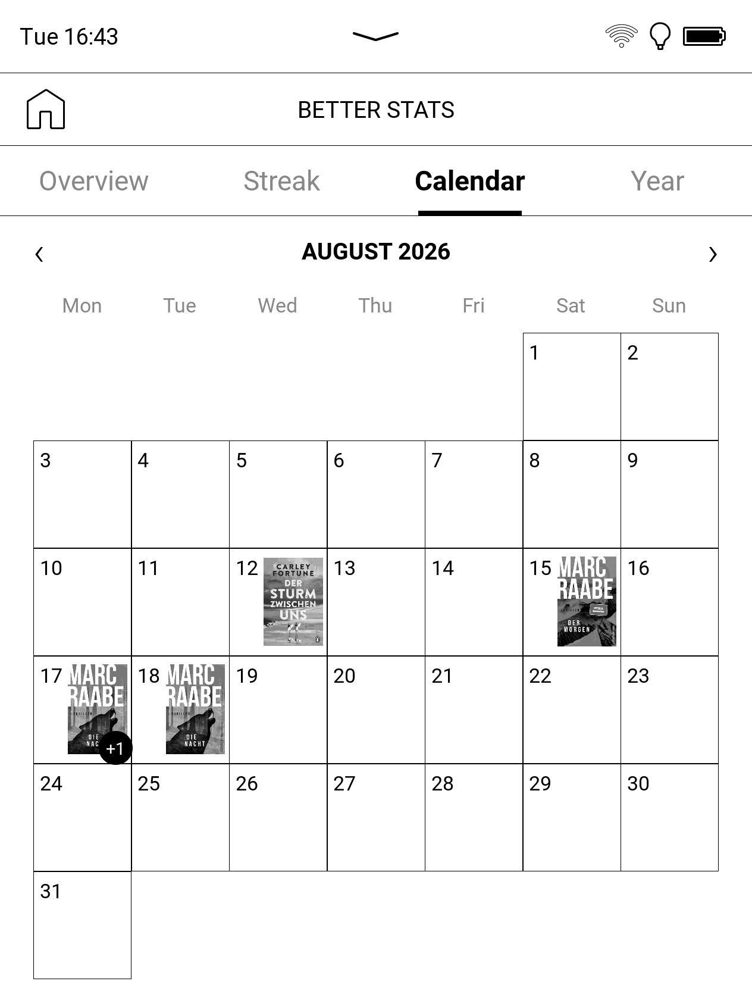
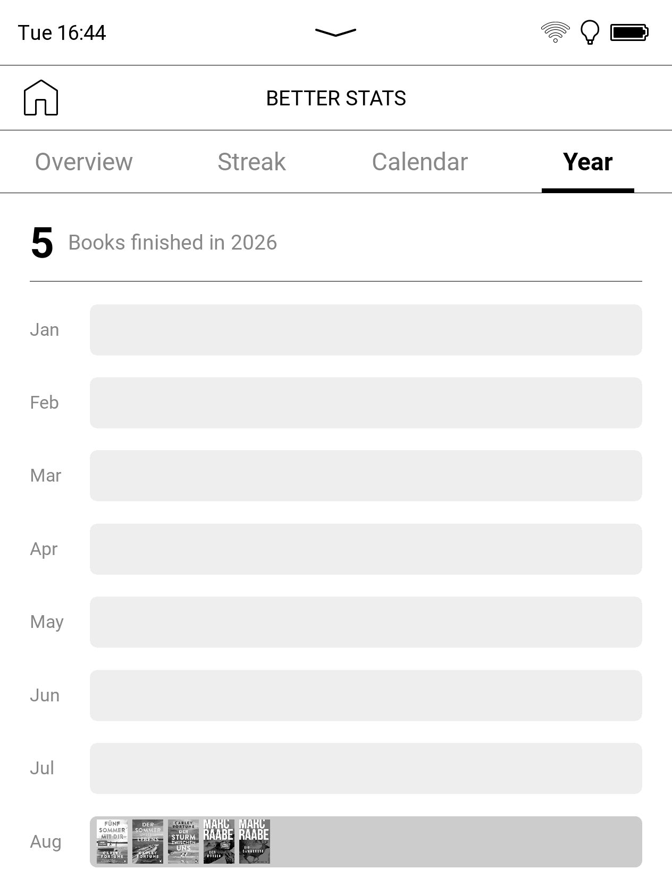

# ReadTrack

Reading statistics for stock PocketBook e-readers — no KOReader, no account, no
cloud. ReadTrack reads what the firmware already records and turns it into the
kind of stats screen you'd expect from Kobo or Fable, using the firmware's own
native UI components so it looks like it belongs on the device.

ReadTrack is a fork of [Better Stats](https://github.com/nikljuel/better-stats)
by Niklas Jülicher, renamed and continued as a separate project. The original
is MIT-licensed and its copyright notice is kept in [LICENSE](LICENSE).

> Built and tested on a **PocketBook Era Lite (PB710), firmware 6.x**. Other
> Allwinner **B288/B300** readers running Qt 6.8 firmware very likely work but are
> untested — feedback welcome.

| Overview | Streak | Calendar | Year |
|:---:|:---:|:---:|:---:|
|  |  |  |  |

## Features

- **Four tabs, no scrolling** (e-ink scrolling is fiddly): Overview · Streak ·
  Calendar · Year.
- **Overview** — current book with cover, progress and estimated time left;
  tiles for time read today, avg minutes per session and pages per minute; a
  "books finished" donut.
- **Streak** — current and best streak, a GitHub-style year heatmap (read days
  and finished-book markers), plus a longest-streak insight line.
- **Calendar** — a month grid showing the cover of the most-read book per day;
  tap a day for a breakdown of books and time.
- **Year** — books finished per month with mini covers; tap a month for the
  finish dates.
- **Native look** — built from the firmware's own `com.pocketbook.controls` QML
  components, so typography, spacing and dark/light follow your device settings.
- **Real covers** — extracted straight from your EPUBs (the firmware's cover
  cache is sometimes wrong for sideloaded/Calibre books).
- **Multilingual** — German, English and Russian, picked from the device
  language; English for anything it doesn't cover. One catalog file per
  language in `qt/qml/i18n/`.

## How it works

A small background daemon (bundled in the same binary) polls the firmware's
library database (`explorer-3.db`) **read-only** every 30 seconds and derives
reading sessions from the book's open time and last position update. Idle gaps
(standby, long pauses) are capped so they don't count as reading time. If the
daemon wasn't running, the last session per book is reconstructed on the next
launch from what the firmware stored, so nothing is silently lost.

The firmware keeps no session history — only a single "last opened" and "last
position" timestamp per book — so the time before you installed ReadTrack
cannot be reconstructed. Rather than pass those guesses off as history, the
stats start at the install date; earlier days are drawn as unknown instead of
as days you didn't read. Finished books are the exception: the firmware does
date those, so they show for the whole year.

"Finished" books come from the firmware's own *mark as read* flag, so they match
what you see in the Library.

## Privacy

Everything stays on the device. No network access, no account, no telemetry.
ReadTrack only **reads** the firmware database; it writes only its own stats
database and cover cache under `system/readtrack/`.

## Install

1. Download the `.zip` from the [latest release](../../releases/latest) and
   unzip it to get `ReadTrack.app`.
2. Connect your reader via USB and copy `ReadTrack.app` into the
   `applications` folder (`/mnt/ext1/applications/`).
3. Eject the reader, open **ReadTrack** once, then reboot the reader so the
   custom icon appears in the apps list.

On first launch the app installs its own launcher icon. To do this it adds one
entry to `system/config/desktop/view.json` and saves a backup next to it
(`view.json.readtrack-backup`). The custom icon then appears after the reader
rescans its apps (reboot if needed). If you'd rather not have the config touched,
the app still runs fine — it just uses the default user-app icon.

To uninstall: delete `applications/ReadTrack.app`. To also remove the icon
entry, restore `view.json` from the backup (or delete the `U_readtrack` entry).

## Building

See [BUILDING.md](BUILDING.md). In short: `make sdk` once, then `make qt`
produces `build-qt/ReadTrack.app`. `make test` runs the host-side tracker
tests.

## Credits

- Forked from [Better Stats](https://github.com/nikljuel/better-stats) by
  Niklas Jülicher (MIT) — the original implementation of the tracker, the
  stats database and the QML UI.
- Cross-compilation and the on-device Qt/InkView bridge build on
  [fstanis/pocketbook-sdk-qt6](https://github.com/fstanis/pocketbook-sdk-qt6).
- Bundles [SQLite](https://www.sqlite.org/) (public domain) and
  [miniz](https://github.com/richgel999/miniz) (MIT) as source.

## License

MIT — see [LICENSE](LICENSE).

## Disclaimer

Not affiliated with PocketBook. Use at your own risk. It only reads the firmware
database and makes a single, backed-up edit to the launcher config for the icon,
but you are installing third-party software on your device.
